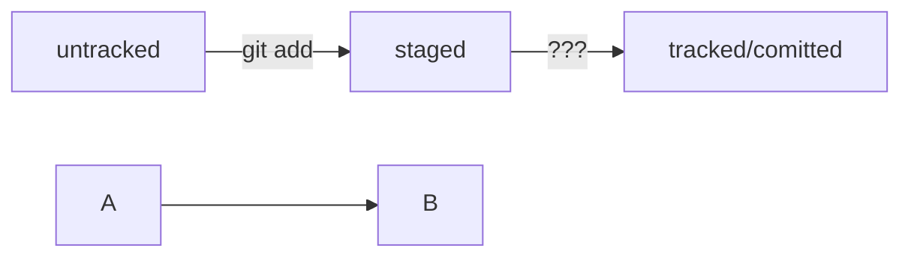

# H1
## H2
### H3
Bold	**bold text**
Italic	*italicized text*
Blockquote	> blockquote
Ordered List	1. First item
2. Second item
3. Third item
Unordered List	- First item
- Second item
- Third item
Code	`code`
Horizontal Rule	---
Link	[title](https://www.example.com)

